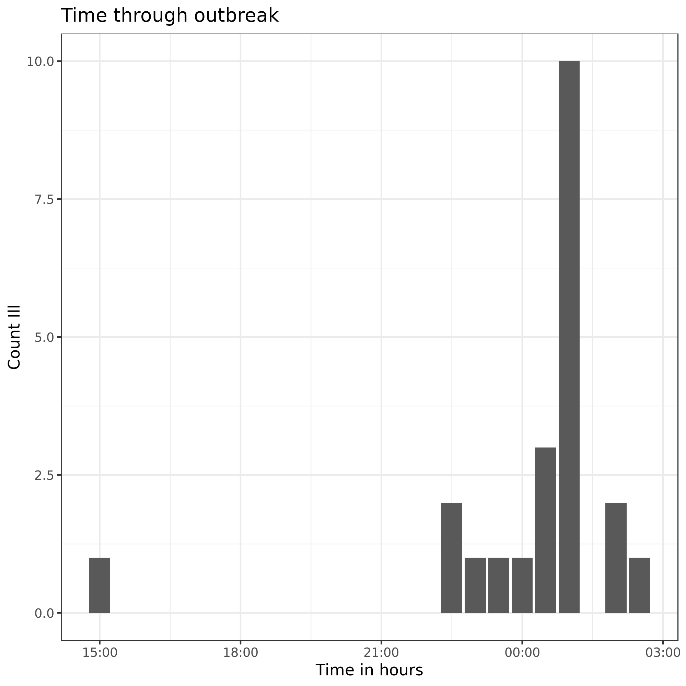

# Scenario

> You are a health officer in a rural town. Your boss has asked you to investigate an acute outbreak of gastroenteritis in the town. When you reach the site, you learn that all persons known to be ill attended a church supper held on the previous evening. Family members who did not attend the supper did not become ill. You decide to proceed with the investigation

---

# Facts about the outbreak
- 80 people attended the church supper. 
- You have information from interviewing 75 of 80 people
- You obtained information about the occurrence of symptoms, time of occurrence, and food they consumed
- 46 of 75 people reported gatrointestinal illness
- Onset of illness was acute

---

# Facts about the illness

- Characterised by nausea, vomitig, diarrhoea, abdominal pain
- None of the affected people reported having fever
- All recovered within 24 hours
- 10 of the 46 people visited local GPs
- No one collected stool specimens for examination
- You suspect that food was the 'vehicle' for this outbreak

---

# Administer a questionnaire
You decide to administer a questionnaire to the church supper participants. What information would you collect? Write as many words/sentences as you can, and rate each other's questions

[Answer the question here](https://www.wooclap.com/OUTBREAK)

---
background-color: #99ccff

# Description of the supper
- The supper was held at the lawn of the church
- Many members of the congregation brought the food
- The supper began at 6:00 pm and ended at 11:00 pm
- A line listing of all 75 people are available 
- (download the csv file and open in your spreadsheet programme or work with the tools in jupyter notebook)

---

# Calculate the statistics of incubation period

- Go to [Jupyter notebook](https://notebooks.azure.com)
- log in with your username and password
- Open the ipynb file
- Download the csv file
- Calculate the incubation period (step by step): 
- Follow the live coding exercise with me

---
class: middle, center
# What does this graph tell you?

[Answer here](https://www.wooclap.com/OUTBREAK)

---

# What does the following table on incubation period tell you?

| Parameter | Hours |
|:----------|:-----:|
| Mean      | 4.29  |
| Median    | 4.0   |
| Minimum   | 3.0   |
| Maximum   | 7.0   |

[Answer the question here](https://www.wooclap.com/OUTBREAK)

---

# Download and read the compendium document
- What seems to be the souce of this outbreak?

[Answer the question here](https://www.wooclap.com/OUTBREAK)

---

# Work with me on live coding
- We will create the following table for each food item

| Food item  | ill | Not ill | Odds Ratio |
|------------|-----|---------|------------|
|  Ate it    |  x  | y       |            |
| did not eat| c   | d       |            |

---

# Fill in the following table

| Food item | Odds Ratio |
|-----------|-------------------|
| Baked ham |                   |
| Spinach   |                   |
| ...      |  ...               |
| Vanilla ice cream | ...                |
| chocolate ice cream | ...       |

---

# Which food item is the offending food item?

[Answer this question](https://www.wooclap.com/OUTBREAK)

---

# What further investigations will you do?

- Group discussion in the class

---

# What control measures will you suggest?

- Group discussion in the class

---

# What have you learned from this exercise?

- Group discussion in the class

---
