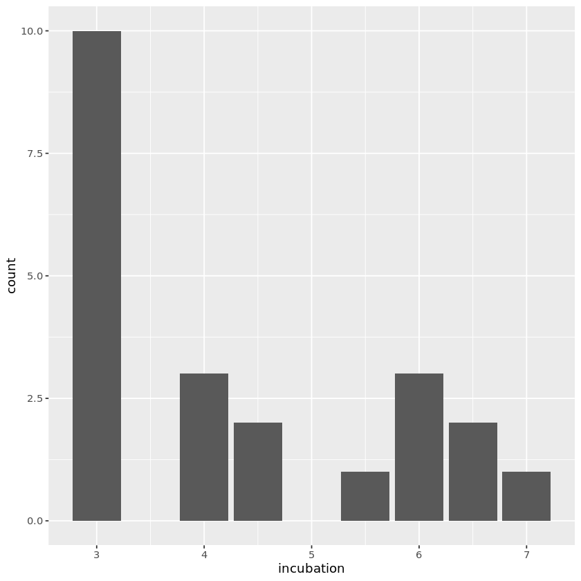
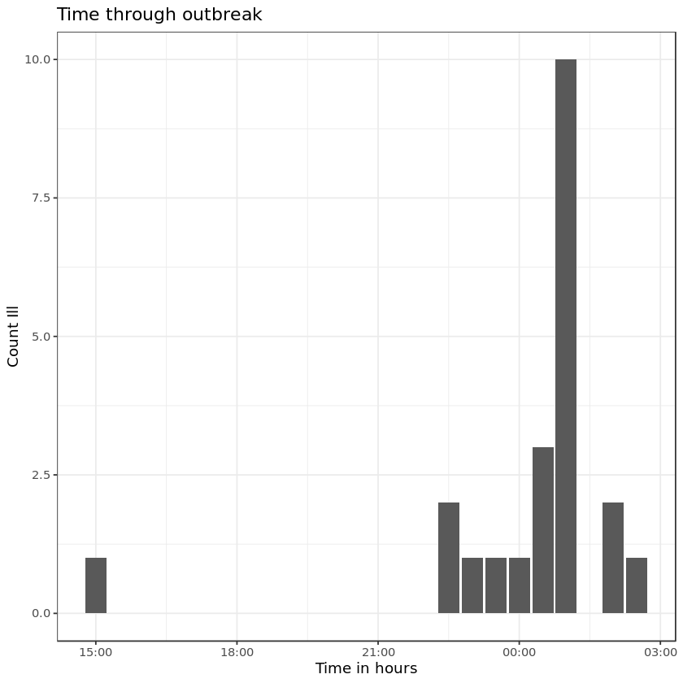

## Scenario
You are a health officer in a rural town. Your boss has asked you to investigate an acute outbreak of gastroenteritis in the town. When you reach the site, you learn that all persons known to be ill attended a church supper held on the previous evening. Family members who did not attend the supper did not become ill. You decide to proceed with the investigation

## Facts about the outbreak
- 80 people attended the church supper. 
- You have information from interviewing 75 of 80 people
- You obtained information about the occurrence of symptoms, time of occurrence, and food they consumed
- 46 of 75 people reported gatrointestinal illness
- Onset of illness was acute

## Facts about the illness

- Characterised by nausea, vomitig, diarrhoea, abdominal pain
- None of the affected people reported having fever
- All recovered within 24 hours
- 10 of the 46 people visited local GPs
- No one collected stool specimens for examination
- You suspect that food was the 'vehicle' for this outbreak

## Administer a questionnaire
You decide to administer a questionnaire to the church supper participants. What information would you collect? Write as many words/sentences as you can, and rate each other's questions

[Answer the question here](https://www.wooclap.com/OUTBREAK)

## Description of the supper
- The supper was held at the lawn of the church
- Many members of the congregation brought the food
- The supper began at 6:00 pm and ended at 11:00 pm
- A line listing of all 75 people are available 
- (download the csv file and open in your spreadsheet programme or work with the tools in jupyter notebook)

## Calculate the statistics of incubation period

- Go to [Jupyter notebook](https://notebooks.azure.com)
- log in with your username and password
- Open the ipynb file
- Download the csv file
- Calculate the incubation period (step by step): 
- Follow the live coding exercise with me

## What does this graph tell you?


[Answer here](https://www.wooclap.com/OUTBREAK)

## What does the following table on incubation period tell you?

| Parameter | Hours |
|:----------|:-----:|
| Mean      | 4.29  |
| Median    | 4.0   |
| Minimum   | 3.0   |
| Maximum   | 7.0   |

[Answer the question here](https://www.wooclap.com/OUTBREAK)

## Download and read the compendium document
- What seems to be the souce of this outbreak?

[Answer the question here](https://www.wooclap.com/OUTBREAK)

## Work with me on live coding
- We will create the following table for each food item

| Food item  | ill | Not ill | Odds Ratio |
|------------|-----|---------|------------|
|  Ate it    |  x  | y       |            |
| did not eat| c   | d       |            |

## Fill in the following table

| Food item | Odds Ratio |
|-----------|-------------------|
| Baked ham |                   |
| Spinach   |                   |
| ...      |  ...               |
| Vanilla ice cream | ...                |
| chocolate ice cream | ...       |

## Which food item is the offending food item?

[Answer this question](https://www.wooclap.com/OUTBREAK)

## What further investigations will you do?

- Group discussion in the class

## What control measures will you suggest?

- Group discussion in the class

## What have you learned from this exercise?

- Group discussion in the class


```R
library(tidyverse)
library(epitools)
```


```R
oswego %>%
  head()
```


<table>
<caption>A data.frame: 6 × 21</caption>
<thead>
	<tr><th scope=col>id</th><th scope=col>age</th><th scope=col>sex</th><th scope=col>meal.time</th><th scope=col>ill</th><th scope=col>onset.date</th><th scope=col>onset.time</th><th scope=col>baked.ham</th><th scope=col>spinach</th><th scope=col>mashed.potato</th><th scope=col>⋯</th><th scope=col>jello</th><th scope=col>rolls</th><th scope=col>brown.bread</th><th scope=col>milk</th><th scope=col>coffee</th><th scope=col>water</th><th scope=col>cakes</th><th scope=col>vanilla.ice.cream</th><th scope=col>chocolate.ice.cream</th><th scope=col>fruit.salad</th></tr>
	<tr><th scope=col>&lt;int&gt;</th><th scope=col>&lt;int&gt;</th><th scope=col>&lt;chr&gt;</th><th scope=col>&lt;chr&gt;</th><th scope=col>&lt;chr&gt;</th><th scope=col>&lt;chr&gt;</th><th scope=col>&lt;chr&gt;</th><th scope=col>&lt;chr&gt;</th><th scope=col>&lt;chr&gt;</th><th scope=col>&lt;chr&gt;</th><th scope=col>⋯</th><th scope=col>&lt;chr&gt;</th><th scope=col>&lt;chr&gt;</th><th scope=col>&lt;chr&gt;</th><th scope=col>&lt;chr&gt;</th><th scope=col>&lt;chr&gt;</th><th scope=col>&lt;chr&gt;</th><th scope=col>&lt;chr&gt;</th><th scope=col>&lt;chr&gt;</th><th scope=col>&lt;chr&gt;</th><th scope=col>&lt;chr&gt;</th></tr>
</thead>
<tbody>
	<tr><td>2</td><td>52</td><td>F</td><td>8:00 PM</td><td>Y</td><td>4/19</td><td>12:30 AM</td><td>Y</td><td>Y</td><td>Y</td><td>⋯</td><td>N</td><td>Y</td><td>N</td><td>N</td><td>Y</td><td>N</td><td>N</td><td>Y</td><td>N</td><td>N</td></tr>
	<tr><td>3</td><td>65</td><td>M</td><td>6:30 PM</td><td>Y</td><td>4/19</td><td>12:30 AM</td><td>Y</td><td>Y</td><td>Y</td><td>⋯</td><td>N</td><td>N</td><td>N</td><td>N</td><td>Y</td><td>N</td><td>N</td><td>Y</td><td>Y</td><td>N</td></tr>
	<tr><td>4</td><td>59</td><td>F</td><td>6:30 PM</td><td>Y</td><td>4/19</td><td>12:30 AM</td><td>Y</td><td>Y</td><td>N</td><td>⋯</td><td>N</td><td>N</td><td>N</td><td>N</td><td>Y</td><td>N</td><td>Y</td><td>Y</td><td>Y</td><td>N</td></tr>
	<tr><td>6</td><td>63</td><td>F</td><td>7:30 PM</td><td>Y</td><td>4/18</td><td>10:30 PM</td><td>Y</td><td>Y</td><td>N</td><td>⋯</td><td>Y</td><td>N</td><td>N</td><td>N</td><td>N</td><td>Y</td><td>N</td><td>Y</td><td>N</td><td>N</td></tr>
	<tr><td>7</td><td>70</td><td>M</td><td>7:30 PM</td><td>Y</td><td>4/18</td><td>10:30 PM</td><td>Y</td><td>Y</td><td>Y</td><td>⋯</td><td>Y</td><td>Y</td><td>Y</td><td>N</td><td>Y</td><td>Y</td><td>N</td><td>Y</td><td>N</td><td>N</td></tr>
	<tr><td>8</td><td>40</td><td>F</td><td>7:30 PM</td><td>Y</td><td>4/19</td><td>2:00 AM </td><td>N</td><td>N</td><td>N</td><td>⋯</td><td>N</td><td>N</td><td>N</td><td>N</td><td>N</td><td>N</td><td>N</td><td>Y</td><td>Y</td><td>N</td></tr>
</tbody>
</table>


```R
oswego1 <- oswego %>%
   select(age: fruit.salad)
library(lubridate)
# head(oswego1)


oswego2 <- oswego1
oswego2$onset_date_time <- paste(oswego2$onset.date, '2018',
                                oswego2$onset.time, sep=" ")
oswego2$onset_date <- paste(oswego2$onset.date, '18', sep = '/')
oswego2$onset_dt <- mdy(oswego2$onset_date)
oswego2$onset_hh <- hour(parse_date_time(oswego2$onset.time, 
                                   '%I:%M: %p'))
oswego2$onset_mm <- minute(parse_date_time(oswego2$onset.time,
                                          '%I:%M:5p'))
oswego2$onset_hm <- paste(oswego2$onset_hh,
                         oswego2$onset_mm, sep=":")
oswego2$onset_dhm <- paste(oswego2$onset_dt, oswego2$onset_hm)
#oswego2$onset_dttm <- paste(oswego2$onset_dt, oswego2$onset.time)
oswego2$onset_dtm <- ymd_hm(oswego2$onset_dhm)
```

    Warning message:
    “ 29 failed to parse.”Warning message:
    “ 29 failed to parse.”


```R
oswego2$supper_date <- rep("2018-04-18", length(oswego2$age))

oswego2$meal_hr <- hour(parse_date_time(oswego2$meal.time,
                                       '%I:%M:%p'))
oswego2$meal_mm <- minute(parse_date_time(oswego2$meal.time,
                                         '%I:%M:%p'))
oswego2$meal_hm <- paste(oswego2$meal_hr, oswego2$meal_mm,
                        sep = ":")
oswego2$meal_dhm <- paste(oswego2$supper_date,
                         oswego2$meal_hm)
oswego2$meal_dtm <- ymd_hm(oswego2$meal_dhm)

oswego2$incubation <- oswego2$onset_dtm - oswego2$meal_dtm

str(oswego2)     

summary_data <- oswego2 %>%
                 summarise(mean_incub = mean(incubation, na.rm = T),
                          median_incub = median(incubation, na.rm = T),
                          min_incub = min(incubation, na.rm = T),
                          max_incub = max(incubation, na.rm = T)) %>%
                 gather(mean_incub:max_incub, key = "incubation", value = 'hours')

summary_data
```

    Warning message:
    “ 48 failed to parse.”

    'data.frame':	75 obs. of  35 variables:
     $ age                : int  52 65 59 63 70 40 15 33 10 32 ...
     $ sex                : chr  "F" "M" "F" "F" ...
     $ meal.time          : chr  "8:00 PM" "6:30 PM" "6:30 PM" "7:30 PM" ...
     $ ill                : chr  "Y" "Y" "Y" "Y" ...
     $ onset.date         : chr  "4/19" "4/19" "4/19" "4/18" ...
     $ onset.time         : chr  "12:30 AM" "12:30 AM" "12:30 AM" "10:30 PM" ...
     $ baked.ham          : chr  "Y" "Y" "Y" "Y" ...
     $ spinach            : chr  "Y" "Y" "Y" "Y" ...
     $ mashed.potato      : chr  "Y" "Y" "N" "N" ...
     $ cabbage.salad      : chr  "N" "Y" "N" "Y" ...
     $ jello              : chr  "N" "N" "N" "Y" ...
     $ rolls              : chr  "Y" "N" "N" "N" ...
     $ brown.bread        : chr  "N" "N" "N" "N" ...
     $ milk               : chr  "N" "N" "N" "N" ...
     $ coffee             : chr  "Y" "Y" "Y" "N" ...
     $ water              : chr  "N" "N" "N" "Y" ...
     $ cakes              : chr  "N" "N" "Y" "N" ...
     $ vanilla.ice.cream  : chr  "Y" "Y" "Y" "Y" ...
     $ chocolate.ice.cream: chr  "N" "Y" "Y" "N" ...
     $ fruit.salad        : chr  "N" "N" "N" "N" ...
     $ onset_date_time    : chr  "4/19 2018 12:30 AM" "4/19 2018 12:30 AM" "4/19 2018 12:30 AM" "4/18 2018 10:30 PM" ...
     $ onset_date         : chr  "4/19/18" "4/19/18" "4/19/18" "4/18/18" ...
     $ onset_dt           : Date, format: "2018-04-19" "2018-04-19" ...
     $ onset_hh           : int  0 0 0 22 22 2 1 23 2 10 ...
     $ onset_mm           : int  30 30 30 30 30 0 0 0 0 30 ...
     $ onset_hm           : chr  "0:30" "0:30" "0:30" "22:30" ...
     $ onset_dhm          : chr  "2018-04-19 0:30" "2018-04-19 0:30" "2018-04-19 0:30" "2018-04-18 22:30" ...
     $ onset_dtm          : POSIXct, format: "2018-04-19 00:30:00" "2018-04-19 00:30:00" ...
     $ supper_date        : chr  "2018-04-18" "2018-04-18" "2018-04-18" "2018-04-18" ...
     $ meal_hr            : int  20 18 18 19 19 19 22 19 19 NA ...
     $ meal_mm            : int  0 30 30 30 30 30 0 0 30 NA ...
     $ meal_hm            : chr  "20:0" "18:30" "18:30" "19:30" ...
     $ meal_dhm           : chr  "2018-04-18 20:0" "2018-04-18 18:30" "2018-04-18 18:30" "2018-04-18 19:30" ...
     $ meal_dtm           : POSIXct, format: "2018-04-18 20:00:00" "2018-04-18 18:30:00" ...
     $ incubation         : 'difftime' num  4.5 6 6 3 ...
      ..- attr(*, "units")= chr "hours"


<table>
<caption>A data.frame: 4 × 2</caption>
<thead>
	<tr><th scope=col>incubation</th><th scope=col>hours</th></tr>
	<tr><th scope=col>&lt;chr&gt;</th><th scope=col>&lt;drtn&gt;</th></tr>
</thead>
<tbody>
	<tr><td>mean_incub  </td><td>4.295455 hours</td></tr>
	<tr><td>median_incub</td><td>4.000000 hours</td></tr>
	<tr><td>min_incub   </td><td>3.000000 hours</td></tr>
	<tr><td>max_incub   </td><td>7.000000 hours</td></tr>
</tbody>
</table>


```R
ill <- oswego2 %>%
  count(ill)

baked_ham <- oswego2 %>%
  count(baked.ham, ill) %>%
  spread(key = ill, value = n) %>%
  mutate(prop_y = Y / sum(Y),
         prop_n = N / sum(N),
         odds_y = prop_y / (1 - prop_y),
         odds_n = prop_n / (1 - prop_n),
        odds_ratio = odds_y / odds_n) %>%
  select(baked.ham, N, Y, odds_ratio)

spinach <- oswego2 %>%
  count(spinach, ill) %>%
  spread(key = ill, value = n) %>%
  mutate(prop_y = Y / sum(Y),
         prop_n = N / sum(N),
         odds_y = prop_y / (1 - prop_y),
         odds_n = prop_n / (1 - prop_n),
        odds_ratio = odds_y / odds_n) %>%
  select(spinach, N, Y, odds_ratio)
        
        
vanilla_ice <- oswego2 %>% 
  count(vanilla.ice.cream, ill) %>%
  spread(key = ill, value = n) %>%
  mutate(prop_y = Y / sum(Y),
         prop_n = N / sum(N),
         odds_y = prop_y / (1 - prop_y),
         odds_n = prop_n / (1 - prop_n),
        odds_ratio = odds_y / odds_n) %>%
  select(vanilla.ice.cream, N, Y, odds_ratio)

choc_ice <- oswego2 %>% 
  count(chocolate.ice.cream, ill) %>%
  spread(key = ill, value = n) 
choc_ice <- choc_ice[complete.cases(choc_ice),] %>%
  mutate(prop_y = Y / sum(Y),
         prop_n = N / sum(N),
         odds_y = prop_y / (1 - prop_y),
         odds_n = prop_n / (1 - prop_n),
        odds_ratio = odds_y / odds_n) %>%
  select(chocolate.ice.cream, N, Y, odds_ratio)
   

ill
baked_ham
spinach
vanilla_ice
choc_ice
17/29
17/75
29 * 12 / (17 * 17)
1.70 / 1.41

```


<table>
<caption>A tibble: 2 × 2</caption>
<thead>
	<tr><th scope=col>ill</th><th scope=col>n</th></tr>
	<tr><th scope=col>&lt;chr&gt;</th><th scope=col>&lt;int&gt;</th></tr>
</thead>
<tbody>
	<tr><td>N</td><td>29</td></tr>
	<tr><td>Y</td><td>46</td></tr>
</tbody>
</table>


<table>
<caption>A tibble: 2 × 4</caption>
<thead>
	<tr><th scope=col>baked.ham</th><th scope=col>N</th><th scope=col>Y</th><th scope=col>odds_ratio</th></tr>
	<tr><th scope=col>&lt;chr&gt;</th><th scope=col>&lt;int&gt;</th><th scope=col>&lt;int&gt;</th><th scope=col>&lt;dbl&gt;</th></tr>
</thead>
<tbody>
	<tr><td>N</td><td>12</td><td>17</td><td>0.8304598</td></tr>
	<tr><td>Y</td><td>17</td><td>29</td><td>1.2041522</td></tr>
</tbody>
</table>


<table>
<caption>A tibble: 2 × 4</caption>
<thead>
	<tr><th scope=col>spinach</th><th scope=col>N</th><th scope=col>Y</th><th scope=col>odds_ratio</th></tr>
	<tr><th scope=col>&lt;chr&gt;</th><th scope=col>&lt;int&gt;</th><th scope=col>&lt;int&gt;</th><th scope=col>&lt;dbl&gt;</th></tr>
</thead>
<tbody>
	<tr><td>N</td><td>12</td><td>20</td><td>1.0897436</td></tr>
	<tr><td>Y</td><td>17</td><td>26</td><td>0.9176471</td></tr>
</tbody>
</table>


<table>
<caption>A tibble: 2 × 4</caption>
<thead>
	<tr><th scope=col>vanilla.ice.cream</th><th scope=col>N</th><th scope=col>Y</th><th scope=col>odds_ratio</th></tr>
	<tr><th scope=col>&lt;chr&gt;</th><th scope=col>&lt;int&gt;</th><th scope=col>&lt;int&gt;</th><th scope=col>&lt;dbl&gt;</th></tr>
</thead>
<tbody>
	<tr><td>N</td><td>18</td><td> 3</td><td> 0.04263566</td></tr>
	<tr><td>Y</td><td>11</td><td>43</td><td>23.45454545</td></tr>
</tbody>
</table>


<table>
<caption>A tibble: 2 × 4</caption>
<thead>
	<tr><th scope=col>chocolate.ice.cream</th><th scope=col>N</th><th scope=col>Y</th><th scope=col>odds_ratio</th></tr>
	<tr><th scope=col>&lt;chr&gt;</th><th scope=col>&lt;int&gt;</th><th scope=col>&lt;int&gt;</th><th scope=col>&lt;dbl&gt;</th></tr>
</thead>
<tbody>
	<tr><td>N</td><td> 7</td><td>20</td><td>2.5142857</td></tr>
	<tr><td>Y</td><td>22</td><td>25</td><td>0.3977273</td></tr>
</tbody>
</table>


0.586206896551724


0.226666666666667


1.20415224913495


1.20567375886525


```R
oswego2 %>%
  ggplot(aes(incubation)) +
  geom_bar()
```

    'data.frame':	22 obs. of  35 variables:
     $ age                : int  52 65 59 63 70 40 15 33 10 13 ...
     $ sex                : chr  "F" "M" "F" "F" ...
     $ meal.time          : chr  "8:00 PM" "6:30 PM" "6:30 PM" "7:30 PM" ...
     $ ill                : chr  "Y" "Y" "Y" "Y" ...
     $ onset.date         : chr  "4/19" "4/19" "4/19" "4/18" ...
     $ onset.time         : chr  "12:30 AM" "12:30 AM" "12:30 AM" "10:30 PM" ...
     $ baked.ham          : chr  "Y" "Y" "Y" "Y" ...
     $ spinach            : chr  "Y" "Y" "Y" "Y" ...
     $ mashed.potato      : chr  "Y" "Y" "N" "N" ...
     $ cabbage.salad      : chr  "N" "Y" "N" "Y" ...
     $ jello              : chr  "N" "N" "N" "Y" ...
     $ rolls              : chr  "Y" "N" "N" "N" ...
     $ brown.bread        : chr  "N" "N" "N" "N" ...
     $ milk               : chr  "N" "N" "N" "N" ...
     $ coffee             : chr  "Y" "Y" "Y" "N" ...
     $ water              : chr  "N" "N" "N" "Y" ...
     $ cakes              : chr  "N" "N" "Y" "N" ...
     $ vanilla.ice.cream  : chr  "Y" "Y" "Y" "Y" ...
     $ chocolate.ice.cream: chr  "N" "Y" "Y" "N" ...
     $ fruit.salad        : chr  "N" "N" "N" "N" ...
     $ onset_date_time    : chr  "4/19 2018 12:30 AM" "4/19 2018 12:30 AM" "4/19 2018 12:30 AM" "4/18 2018 10:30 PM" ...
     $ onset_date         : chr  "4/19/18" "4/19/18" "4/19/18" "4/18/18" ...
     $ onset_dt           : Date, format: "2018-04-19" "2018-04-19" ...
     $ onset_hh           : int  0 0 0 22 22 2 1 23 2 1 ...
     $ onset_mm           : int  30 30 30 30 30 0 0 0 0 0 ...
     $ onset_hm           : chr  "0:30" "0:30" "0:30" "22:30" ...
     $ onset_dhm          : chr  "2018-04-19 0:30" "2018-04-19 0:30" "2018-04-19 0:30" "2018-04-18 22:30" ...
     $ onset_dtm          : POSIXct, format: "2018-04-19 00:30:00" "2018-04-19 00:30:00" ...
     $ supper_date        : chr  "2018-04-18" "2018-04-18" "2018-04-18" "2018-04-18" ...
     $ meal_hr            : int  20 18 18 19 19 19 22 19 19 22 ...
     $ meal_mm            : int  0 30 30 30 30 30 0 0 30 0 ...
     $ meal_hm            : chr  "20:0" "18:30" "18:30" "19:30" ...
     $ meal_dhm           : chr  "2018-04-18 20:0" "2018-04-18 18:30" "2018-04-18 18:30" "2018-04-18 19:30" ...
     $ meal_dtm           : POSIXct, format: "2018-04-18 20:00:00" "2018-04-18 18:30:00" ...
     $ incubation         : 'difftime' num  4.5 6 6 3 ...
      ..- attr(*, "units")= chr "hours"


    Don't know how to automatically pick scale for object of type difftime. Defaulting to continuous.





```R
  ggplot(oswego2, aes(onset_dtm)) +
  geom_bar() +
  labs(x = "Time in hours",
      y = "Count Ill",
      title = "Time through outbreak") +
  theme_bw() +
  ggsave("outbreak1.png")

```

    Saving 6.67 x 6.67 in image





```R
library(epitools)
```


```R
data(package = 'epitools')
```


<h3>Data sets</h3>
<table>
<caption>A data.frame: 3 × 3</caption>
<thead>
	<tr><th scope=col>Package</th><th scope=col>Item</th><th scope=col>Title</th></tr>
	<tr><th scope=col>&lt;chr&gt;</th><th scope=col>&lt;chr&gt;</th><th scope=col>&lt;chr&gt;</th></tr>
</thead>
<tbody>
	<tr><td>epitools</td><td>oswego</td><td>Outbreak of Gastrointestinal Illness in Oswego County, 1940                     </td></tr>
	<tr><td>epitools</td><td>wcgs  </td><td>Western Collaborative Group Study data                                          </td></tr>
	<tr><td>epitools</td><td>wnv   </td><td>West Nile Virus human cases reported in California, USA, as of December 14, 2004</td></tr>
</tbody>
</table>


```R
data(oswego)
```


```R
library(tidyverse)
```

    ── Attaching packages ─────────────────────────────────────── tidyverse 1.2.1 ──
    ✔ ggplot2 3.2.0     ✔ purrr   0.3.2
    ✔ tibble  2.1.3     ✔ dplyr   0.8.3
    ✔ tidyr   0.8.3     ✔ stringr 1.4.0
    ✔ readr   1.3.1     ✔ forcats 0.4.0
    ── Conflicts ────────────────────────────────────────── tidyverse_conflicts() ──
    ✖ dplyr::filter() masks stats::filter()
    ✖ dplyr::lag()    masks stats::lag()


```R
oswego %>% 
  write_csv(path="outbreak.csv")
```


```R
?write_csv
```


<table width="100%" summary="page for write_delim {readr}"><tr><td>write_delim {readr}</td><td style="text-align: right;">R Documentation</td></tr></table>

<h2>Write a data frame to a delimited file</h2>

<h3>Description</h3>

<p>This is about twice as fast as <code>write.csv()</code>, and never
writes row names. <code>output_column()</code> is a generic method used to coerce
columns to suitable output.
</p>


<h3>Usage</h3>

<pre>
write_delim(x, path, delim = " ", na = "NA", append = FALSE,
  col_names = !append, quote_escape = "double")

write_csv(x, path, na = "NA", append = FALSE, col_names = !append,
  quote_escape = "double")

write_csv2(x, path, na = "NA", append = FALSE, col_names = !append,
  quote_escape = "double")

write_excel_csv(x, path, na = "NA", append = FALSE,
  col_names = !append, delim = ",", quote_escape = "double")

write_excel_csv2(x, path, na = "NA", append = FALSE,
  col_names = !append, delim = ";", quote_escape = "double")

write_tsv(x, path, na = "NA", append = FALSE, col_names = !append,
  quote_escape = "double")
</pre>


<h3>Arguments</h3>

<table summary="R argblock">
<tr valign="top"><td><code>x</code></td>
<td>
<p>A data frame to write to disk</p>
</td></tr>
<tr valign="top"><td><code>path</code></td>
<td>
<p>Path or connection to write to.</p>
</td></tr>
<tr valign="top"><td><code>delim</code></td>
<td>
<p>Delimiter used to separate values. Defaults to <code>" "</code> for <code>write_delim()</code>, <code>","</code> for <code>write_excel_csv()</code> and
<code>";"</code> for <code>write_excel_csv2()</code>. Must be a single character.</p>
</td></tr>
<tr valign="top"><td><code>na</code></td>
<td>
<p>String used for missing values. Defaults to NA. Missing values
will never be quoted; strings with the same value as <code>na</code> will
always be quoted.</p>
</td></tr>
<tr valign="top"><td><code>append</code></td>
<td>
<p>If <code>FALSE</code>, will overwrite existing file. If <code>TRUE</code>,
will append to existing file. In both cases, if file does not exist a new
file is created.</p>
</td></tr>
<tr valign="top"><td><code>col_names</code></td>
<td>
<p>Write columns names at the top of the file? Must be either
<code>TRUE</code> or <code>FALSE</code>.</p>
</td></tr>
<tr valign="top"><td><code>quote_escape</code></td>
<td>
<p>The type of escaping to use for quoted values, one of
&quot;double&quot;, &quot;backslash&quot; or &quot;none&quot;. You can also use <code>FALSE</code>, which is
equivalent to &quot;none&quot;. The default is to double the quotes, which is the
format excel expects.</p>
</td></tr>
</table>


<h3>Value</h3>

<p><code>write_*()</code> returns the input <code>x</code> invisibly.
</p>


<h3>Output</h3>

<p>Factors are coerced to character. Doubles are formatted using the grisu3
algorithm. POSIXct's are formatted as ISO8601 with a UTC timezone <em>Note:
<code>POSIXct</code> objects in local or non-UTC timezones will be converted to UTC time
before writing.</em>
</p>
<p>All columns are encoded as UTF-8. <code>write_excel_csv()</code> and <code>write_excel_csv2()</code> also include a
<a href="https://en.wikipedia.org/wiki/Byte_order_mark">UTF-8 Byte order mark</a>
which indicates to Excel the csv is UTF-8 encoded.
</p>
<p><code>write_excel_csv2()</code> and <code>write_csv2</code> were created to allow users with
different locale settings save csv files with their default settings <code>;</code> as
column separator and <code>,</code> as decimal separator. This is common in some European countries.
</p>
<p>Values are only quoted if needed: if they contain a comma, quote or newline.
</p>
<p>The <code>write_*()</code> functions will automatically compress outputs if an appropriate extension is given. At present, three
extensions are supported, <code>.gz</code> for gzip compression, <code>.bz2</code> for bzip2 compression and <code>.xz</code> for lzma compression.  See
the examples for more information.
</p>


<h3>References</h3>

<p>Florian Loitsch, Printing Floating-Point Numbers Quickly and
Accurately with Integers, PLDI '10,
<a href="http://www.cs.tufts.edu/~nr/cs257/archive/florian-loitsch/printf.pdf">http://www.cs.tufts.edu/~nr/cs257/archive/florian-loitsch/printf.pdf</a>
</p>


<h3>Examples</h3>

<pre>
tmp &lt;- tempfile()
write_csv(mtcars, tmp)
head(read_csv(tmp))

# format_* is useful for testing and reprexes
cat(format_csv(head(mtcars)))
cat(format_tsv(head(mtcars)))
cat(format_delim(head(mtcars), ";"))

df &lt;- data.frame(x = c(1, 2, NA))
format_csv(df, na = ".")

# Quotes are automatically as needed
df &lt;- data.frame(x = c("a", '"', ",", "\n"))
cat(format_csv(df))

# A output connection will be automatically created for output filenames
# with appropriate extensions.
dir &lt;- tempdir()
write_tsv(mtcars, file.path(dir, "mtcars.tsv.gz"))
write_tsv(mtcars, file.path(dir, "mtcars.tsv.bz2"))
write_tsv(mtcars, file.path(dir, "mtcars.tsv.xz"))
</pre>

<hr /><div style="text-align: center;">[Package <em>readr</em> version 1.3.1 ]</div>


```R
length(oswego2$age)
```


22


```R
oswego %>%
 head()
```


<table>
<caption>A data.frame: 6 × 21</caption>
<thead>
	<tr><th scope=col>id</th><th scope=col>age</th><th scope=col>sex</th><th scope=col>meal.time</th><th scope=col>ill</th><th scope=col>onset.date</th><th scope=col>onset.time</th><th scope=col>baked.ham</th><th scope=col>spinach</th><th scope=col>mashed.potato</th><th scope=col>⋯</th><th scope=col>jello</th><th scope=col>rolls</th><th scope=col>brown.bread</th><th scope=col>milk</th><th scope=col>coffee</th><th scope=col>water</th><th scope=col>cakes</th><th scope=col>vanilla.ice.cream</th><th scope=col>chocolate.ice.cream</th><th scope=col>fruit.salad</th></tr>
	<tr><th scope=col>&lt;int&gt;</th><th scope=col>&lt;int&gt;</th><th scope=col>&lt;chr&gt;</th><th scope=col>&lt;chr&gt;</th><th scope=col>&lt;chr&gt;</th><th scope=col>&lt;chr&gt;</th><th scope=col>&lt;chr&gt;</th><th scope=col>&lt;chr&gt;</th><th scope=col>&lt;chr&gt;</th><th scope=col>&lt;chr&gt;</th><th scope=col>⋯</th><th scope=col>&lt;chr&gt;</th><th scope=col>&lt;chr&gt;</th><th scope=col>&lt;chr&gt;</th><th scope=col>&lt;chr&gt;</th><th scope=col>&lt;chr&gt;</th><th scope=col>&lt;chr&gt;</th><th scope=col>&lt;chr&gt;</th><th scope=col>&lt;chr&gt;</th><th scope=col>&lt;chr&gt;</th><th scope=col>&lt;chr&gt;</th></tr>
</thead>
<tbody>
	<tr><td>2</td><td>52</td><td>F</td><td>8:00 PM</td><td>Y</td><td>4/19</td><td>12:30 AM</td><td>Y</td><td>Y</td><td>Y</td><td>⋯</td><td>N</td><td>Y</td><td>N</td><td>N</td><td>Y</td><td>N</td><td>N</td><td>Y</td><td>N</td><td>N</td></tr>
	<tr><td>3</td><td>65</td><td>M</td><td>6:30 PM</td><td>Y</td><td>4/19</td><td>12:30 AM</td><td>Y</td><td>Y</td><td>Y</td><td>⋯</td><td>N</td><td>N</td><td>N</td><td>N</td><td>Y</td><td>N</td><td>N</td><td>Y</td><td>Y</td><td>N</td></tr>
	<tr><td>4</td><td>59</td><td>F</td><td>6:30 PM</td><td>Y</td><td>4/19</td><td>12:30 AM</td><td>Y</td><td>Y</td><td>N</td><td>⋯</td><td>N</td><td>N</td><td>N</td><td>N</td><td>Y</td><td>N</td><td>Y</td><td>Y</td><td>Y</td><td>N</td></tr>
	<tr><td>6</td><td>63</td><td>F</td><td>7:30 PM</td><td>Y</td><td>4/18</td><td>10:30 PM</td><td>Y</td><td>Y</td><td>N</td><td>⋯</td><td>Y</td><td>N</td><td>N</td><td>N</td><td>N</td><td>Y</td><td>N</td><td>Y</td><td>N</td><td>N</td></tr>
	<tr><td>7</td><td>70</td><td>M</td><td>7:30 PM</td><td>Y</td><td>4/18</td><td>10:30 PM</td><td>Y</td><td>Y</td><td>Y</td><td>⋯</td><td>Y</td><td>Y</td><td>Y</td><td>N</td><td>Y</td><td>Y</td><td>N</td><td>Y</td><td>N</td><td>N</td></tr>
	<tr><td>8</td><td>40</td><td>F</td><td>7:30 PM</td><td>Y</td><td>4/19</td><td>2:00 AM </td><td>N</td><td>N</td><td>N</td><td>⋯</td><td>N</td><td>N</td><td>N</td><td>N</td><td>N</td><td>N</td><td>N</td><td>Y</td><td>Y</td><td>N</td></tr>
</tbody>
</table>


```R

```
